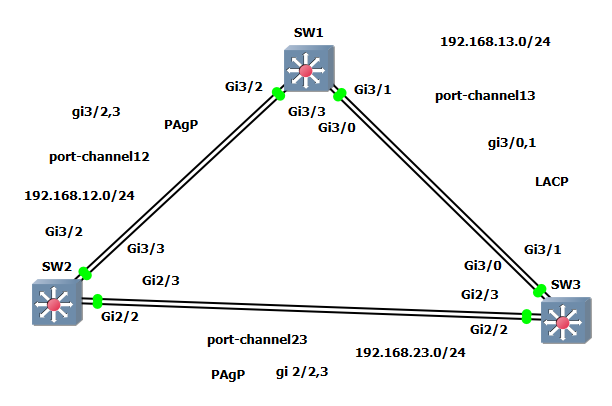

# 07. EtherChannel (Link Aggregation)

## 🖧 토폴로지



```
                 ┌──────────┐
                 │   SW1    │
            Gi3/2│          │Gi3/1
            Gi3/3│          │Gi3/0
                 └──────────┘
        port-channel12 │  │ port-channel13
            (PAgP)     │  │   (LACP)
        192.168.12.0/24│  │192.168.13.0/24
        Gi3/2 ┌────────┘  └────────┐ Gi3/1
        Gi3/3 │                    │ Gi3/0
         ┌──────────┐        ┌──────────┐
         │   SW2    │════════│   SW3    │
         └──────────┘ Gi2/2  └──────────┘
          Gi2/2  Gi2/3  port-channel23  Gi2/3 Gi2/2
                        (PAgP)
                        192.168.23.0/24
```

| Port-Channel | 구간 | 프로토콜 | 포트 |
| --- | --- | --- | --- |
| Po12 | SW1 ↔ SW2 | PAgP | SW1 Gi3/2-3, SW2 Gi3/2-3 |
| Po13 | SW1 ↔ SW3 | LACP | SW1 Gi3/0-1, SW3 Gi3/0-1 |
| Po23 | SW2 ↔ SW3 | PAgP | SW2 Gi2/2-3, SW3 Gi2/2-3 |

---

## 📌 EtherChannel이란?

**EtherChannel**은 다수의 물리적 인터페이스를 하나의 논리적 인터페이스로 묶어서
연결 및 통신하는 기능이다. (반대로 **Sub-interface**는 하나의 물리 인터페이스를
다수의 논리 인터페이스로 분할하는 기능이다.)

### 왜 필요한가? (병목 현상 해결)

- SW1, SW2에 각각 PC 20대가 연결된 환경에서 두 스위치를 1개 링크로만 연결하면
  해당 포트 하나로 모든 트래픽을 처리해야 하므로 **병목 현상**이 발생한다.
- 링크를 추가로 연결해도 **STP**에 의해 하나의 포트를 제외한 나머지가 **Blocking**되어
  실제 사용 포트는 1개로 제한된다 → 병목은 그대로 유지된다.
- **EtherChannel**로 묶으면 여러 물리 링크를 STP가 **하나의 논리 포트**로 인식하여
  Blocking 없이 **대역폭을 합산(부하 분산)** 할 수 있다.

> EtherChannel은 **L2 EtherChannel**과 **L3 EtherChannel**로 구성할 수 있다.

---

## 🧱 L2 EtherChannel 사용 가능 / 불가 환경

| 구분 | 내용 |
| --- | --- |
| ❌ 사용 불가 | **SPAN**, **Port-Security**가 설정된 포트 |
| ✅ 사용 권장 | 병목 현상으로 **트래픽 지연이 발생하는 구간** |

---

## 🔀 협상 프로토콜 (PAgP / LACP / ON)

| 프로토콜 | 구분 | 모드 | 설명 |
| --- | --- | --- | --- |
| **PAgP** | Cisco 전용 (최대 8개) | `desirable` | PAgP로 구성 가능 + 협상 메시지 송/수신 (능동) |
|  |  | `auto` | 평소엔 협상 안 함, 메시지 수신 시 PAgP 구성 (수동) |
| **LACP** | 표준 (최대 16개) | `active` | LACP로 구성 가능 + 협상 메시지 송/수신 (능동) |
|  | → 8 활성 + 8 대기(hot-standby) | `passive` | 평소엔 협상 안 함, 메시지 수신 시 LACP 구성 (수동) |
| **ON** | 협상 없음 (현재 사용 X) | `on` | 프로토콜 없이 단독 구성 → 연결 유/무 확인 불가 |

### ✅ 정상 묶이는 모드 조합

| SW1 | SW2 | 결과 |
| --- | --- | --- |
| `active` / `desirable` | `passive` / `auto` | ✅ |
| `passive` / `auto` | `active` / `desirable` | ✅ |
| `active` / `desirable` | `active` / `desirable` | ✅ |

> ⚠️ `passive`↔`passive`, `auto`↔`auto` 조합은 양쪽 모두 수동이라 **협상 실패**한다.

---

## ⚙️ 설정 방법 (기본 구문)

### PAgP
```bash
interface port-channel x        ! x = 1~64
!
interface range gi3/2 - 3
 channel-protocol pagp
 channel-group x mode [desirable | auto]
!
```

### LACP
```bash
interface port-channel x
!
interface range gi3/0 - 1
 channel-protocol lacp
 channel-group x mode [active | passive]
!
```

### ON
```bash
interface port-channel x
!
interface range gi3/0 - 1
 channel-group x mode on
!
```

---

## 🧪 실습 ① — L2 EtherChannel

### SW1
```bash
en
conf t
host SW1
!
int port-channel 12
 switchport trunk encapsulation dot1q
 switchport mode trunk
int range gi3/2-3
 channel-protocol pagp
 channel-group 12 mode desirable
!
int port-channel 13
 switchport trunk encapsulation dot1q
 switchport mode trunk
int range gi3/0-1
 channel-protocol lacp
 channel-group 13 mode active
end
wr
```

### SW2
```bash
en
conf t
host SW2
!
int port-channel 12
 switchport trunk encapsulation dot1q
 switchport mode trunk
int range gi3/2-3
 channel-protocol pagp
 channel-group 12 mode desirable
!
int port-channel 23
 switchport trunk encapsulation dot1q
 switchport mode trunk
int range gi2/2-3
 channel-protocol pagp
 channel-group 23 mode desirable
end
wr
```

### SW3
```bash
en
conf t
host SW3
!
int port-channel 13
 switchport trunk encapsulation dot1q
 switchport mode trunk
int range gi3/0-1
 channel-protocol lacp
 channel-group 13 mode active
!
int port-channel 23
 switchport trunk encapsulation dot1q
 switchport mode trunk
int range gi2/2-3
 channel-protocol pagp
 channel-group 23 mode desirable
end
wr
```

### ✅ 검증
```bash
show etherchannel summary
show interfaces port-channel 12
show interfaces trunk
show spanning-tree
```

```text
SW1#show etherchannel summary
Flags:  D - down        P - bundled in port-channel
        S - Layer2      U - in use
...
Group  Port-channel  Protocol    Ports
------+-------------+-----------+----------------------------------------
12     Po12(SU)        PAgP      Gi3/2(P) Gi3/3(P)
13     Po13(SU)        LACP      Gi3/0(P) Gi3/1(P)
```

> `(SU)` = **S**(Layer2) + **U**(in use), `(P)` = **bundled**(정상 묶임).
> BW가 단일 링크의 2배(예: `BW 2000000 Kbit`)로 표시되면 정상 합산된 것이다.

---

## 🧪 실습 ② — L3 EtherChannel

L3 EtherChannel은 `ip routing` 활성화 후, port-channel과 물리 포트에
**`no switchport`** 를 적용하고 port-channel에 **IP를 직접 할당**한다.

### SW1
```bash
en
conf t
host SW1
ip routing
!
int port-channel 12
 no switchport
 ip address 192.168.12.1 255.255.255.0
int range gi3/2-3
 channel-protocol pagp
 channel-group 12 mode desirable
!
int port-channel 13
 no switchport
 ip address 192.168.13.1 255.255.255.0
int range gi3/0-1
 channel-protocol lacp
 channel-group 13 mode active
end
wr
```

### SW2
```bash
en
conf t
host SW2
ip routing
!
int port-channel 12
 no switchport
 ip address 192.168.12.2 255.255.255.0
int range gi3/2-3
 channel-protocol pagp
 channel-group 12 mode desirable
!
int port-channel 23
 no switchport
 ip address 192.168.23.2 255.255.255.0
int range gi2/2-3
 channel-protocol pagp
 channel-group 23 mode desirable
end
wr
```

### SW3
```bash
en
conf t
host SW3
ip routing
!
int port-channel 13
 no switchport
 ip address 192.168.13.3 255.255.255.0
int range gi3/0-1
 channel-protocol lacp
 channel-group 13 mode active
!
int port-channel 23
 no switchport
 ip address 192.168.23.3 255.255.255.0
int range gi2/2-3
 channel-protocol pagp
 channel-group 23 mode desirable
end
wr
```

### ✅ 검증
```bash
show etherchannel summary
show ip interface brief
show ip route
ping 192.168.12.2
```

> L3 EtherChannel은 summary에서 `(RU)` = **R**(Layer3) + **U**(in use)로 표시된다.

---

## 📊 L2 vs L3 EtherChannel

| 구분 | L2 EtherChannel | L3 EtherChannel |
| --- | --- | --- |
| port-channel 설정 | `switchport mode trunk` | `no switchport` + `ip address` |
| IP 할당 | ❌ (트렁크) | ✅ (port-channel에 직접) |
| 전제 조건 | — | `ip routing` 필요 |
| summary 표시 | `(SU)` | `(RU)` |
| 용도 | VLAN 트렁크 대역폭 확장 | L3 백본 P2P 링크 |

---

## 💡 핵심 정리

- **EtherChannel** = 여러 물리 링크를 1개 논리 링크로 묶어 **대역폭 합산 + STP Blocking 회피**
- 협상 프로토콜: **PAgP**(Cisco, 최대 8) / **LACP**(표준, 8활성+8대기) / **ON**(협상 없음)
- 모드 조합: `desirable/active`(능동) ↔ `auto/passive`(수동), **수동↔수동은 실패**
- L2는 `switchport mode trunk`, L3는 `no switchport` + `ip address` (`ip routing` 필수)
- 묶음에 참여하려면 **속도/듀플렉스/VLAN/트렁크 설정**이 양쪽 동일해야 함
- 검증은 `show etherchannel summary` → `(P)`, `(SU)`/`(RU)` 확인

---

⬅️ 이전: [06. OSPF](../06_ospf/ospf.md) | 🏠 [README](../README.md)
